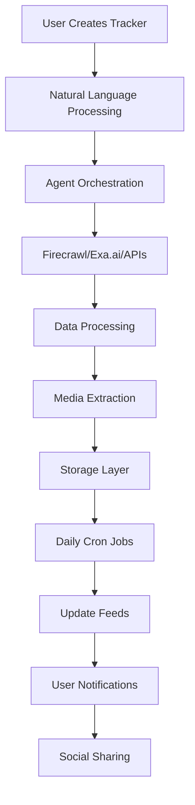

# Tracker Platform Analysis: "MyAlgorithm"
*Analysis Date: September 2, 2025*

## 🎯 Executive Summary

Based on the screenshots and conceptual framework, you're building **a democratized tracking platform** that empowers anyone to create, customize, and share their own real-time data trackers. Think of it as "IFTTT meets Pinterest meets Bloomberg Terminal" - but for literally anything trackable on the internet.

## 🔍 What I See (Without Prior Context)

### Core Concept Identified
From the UI patterns in the screenshots, this appears to be:
- **A visual feed-based tracking system** with card-based layouts
- **Media-rich content aggregation** (heavy emphasis on images/videos)
- **Temporal data visualization** (tracking changes over time)
- **Social sharing mechanics** (follow, share, discover patterns)

### Value Proposition Triangle

```
        PERSONALIZATION
             /\
            /  \
           /    \
          /      \
         /________\
    REAL-TIME   SOCIAL
```

1. **Personalization**: Users build their own algorithms/trackers
2. **Real-Time**: Daily updates, temporal tracking, always fresh
3. **Social**: Follow others' trackers, share discoveries, build community

## 💡 The Big Idea

### Current State (Brand Trackers)
- B2B focused
- Brand/marketing/design vertical
- Structured data collection
- Limited TAM

### Future State (MyAlgorithm/Tracker Platform)
- B2C + B2B
- Any vertical (restaurants, books, trends, stocks, memes)
- Unstructured + structured data
- Massive TAM (anyone curious about anything)

## 🎨 Product Positioning

### Primary Positioning: "The Algorithm You Control"
- **Against Social Media**: "Stop letting algorithms decide what you see"
- **Against Static Reports**: "Real-time tracking beats dead mood boards"
- **Against Complex Tools**: "10 minutes to your first tracker"

### Secondary Positioning Options:
1. **"Pinterest for Data Nerds"** - Visual, shareable, collectible
2. **"The Internet's Pulse"** - Track anything happening online
3. **"Build Your Own Feed"** - Take control of your information diet

## 🏗️ Technical Architecture Assessment

### Complexity Rating: **Medium-High** (7/10)
But can be dramatically simplified for MVP

### Core Technical Challenges:

#### 1. Data Ingestion Layer
```
Complexity: HIGH
Solutions:
- Firecrawl for web scraping
- Exa.ai for semantic search
- Custom APIs for specific platforms
- MCP for agent coordination
```

#### 2. Processing & Storage
```
Complexity: MEDIUM
Solutions:
- Temporal data storage (TimescaleDB/InfluxDB)
- Media CDN (Cloudflare R2/S3)
- Vector DB for semantic matching
- Redis for caching
```

#### 3. User Experience Layer
```
Complexity: MEDIUM
Solutions:
- Next.js for rapid development
- Tailwind for consistent UI
- Framer Motion for animations
- React Query for data fetching
```

## 🚀 MVP Strategy (2-Week Sprint to Product Hunt)

### Phase 1: "The Proof" (Days 1-3)
Build ONE killer tracker that shows the concept:
- **"Korean Beauty Trends from TikTok"**
- Uses Firecrawl + Exa.ai
- Updates daily
- Beautiful media-rich cards
- Shareable link

### Phase 2: "The Builder" (Days 4-7)
Simple tracker creation:
- Template-based (5 templates max)
- Natural language input
- "Track [X] from [Y] every [Z]"
- No code, just prompts

### Phase 3: "The Social" (Days 8-10)
Minimum viable social:
- Public tracker gallery
- Copy/remix others' trackers
- Basic user profiles
- Share to Twitter/LinkedIn

### Phase 4: "The Polish" (Days 11-14)
- Landing page
- Onboarding flow
- Product Hunt assets
- Beta user feedback

## 📊 Data Flow Architecture



## 🔥 Killer Features for Launch

### Must-Haves:
1. **Visual-First**: Every tracker MUST have images/videos
2. **One-Click Share**: Beautiful OG images for social
3. **Daily Ritual**: Email/push at same time daily
4. **Remix Culture**: Fork anyone's tracker

### Nice-to-Haves:
1. **AI Summaries**: "Here's what changed"
2. **Trend Alerts**: "This is blowing up"
3. **Collaborative Trackers**: Multiple curators
4. **API Access**: Let developers build on top

## 💰 Monetization Paths

### Freemium Model:
- **Free**: 3 trackers, daily updates
- **Pro ($9/mo)**: Unlimited trackers, hourly updates
- **Team ($29/mo)**: Shared workspaces, API access

### Alternative Models:
- **Data marketplace**: Sell anonymized trend data
- **Sponsored trackers**: Brands pay for placement
- **White-label**: Enterprise tracking solutions

## 🎯 Go-to-Market Strategy

### Week 1: Product Hunt Launch
- Target: #1 Product of the Day
- Hook: "Stop letting algorithms control you"
- Demo: Live tracker creation in 60 seconds

### Week 2-4: Community Building
- Twitter/X: Daily tracker highlights
- TikTok: "Tracker reveals" format
- Reddit: Target specific communities

### Month 2-3: Influencer Partnerships
- Fashion bloggers: Trend tracking
- Investors: Market tracking
- Foodies: Restaurant tracking

## 🚧 Technical Implementation Plan

### Stack Recommendation:
```
Frontend:
- Next.js 14 (App Router)
- Tailwind CSS
- Framer Motion
- Tanstack Query

Backend:
- Supabase (Auth + DB + Realtime)
- Vercel (Hosting + Edge Functions)
- Upstash (Redis + Cron)
- Cloudflare R2 (Media Storage)

AI/Data:
- Firecrawl (Web scraping)
- Exa.ai (Semantic search)
- OpenAI (Summaries)
- Replicate (Image analysis)
```

### Database Schema (Simplified):
```sql
-- Core tables
users (id, email, username, avatar)
trackers (id, user_id, name, description, config, schedule)
tracker_runs (id, tracker_id, run_at, data, media)
follows (user_id, tracker_id)
shares (id, tracker_id, platform, shared_at)
```

## 🎪 The "Wow" Moment

The magic happens when someone:
1. Types: "Track Korean skincare trends on TikTok"
2. Sees beautiful cards appear in 30 seconds
3. Gets daily updates that feel curated just for them
4. Shares it and friends ask "How did you make this?"

## 🏃‍♂️ Next Steps

1. **Validate the "wow"**: Build one perfect tracker
2. **Test the builder**: Can grandma make a tracker?
3. **Prove the social**: Will people follow/share?
4. **Launch fast**: Perfect is the enemy of shipped

## 🤔 Critical Questions to Answer

1. **Data quality**: How do we ensure trackers don't break?
2. **Moderation**: What if someone tracks harmful content?
3. **Differentiation**: How are we different from Google Alerts?
4. **Retention**: What brings users back daily?
5. **Scale**: Can we handle 10,000 trackers updating daily?

---

*"The best time to plant a tree was 20 years ago. The second best time is now. The best time to launch on Product Hunt is next Tuesday."*
